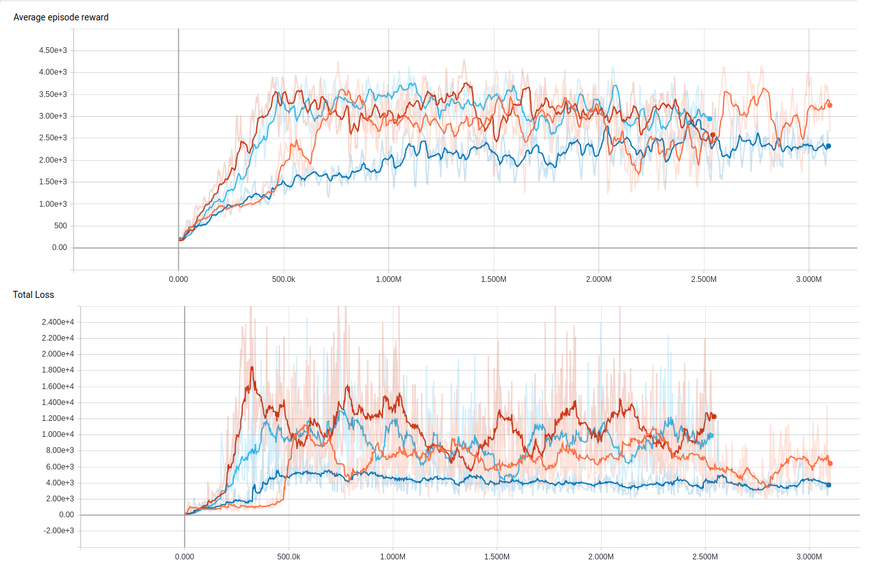
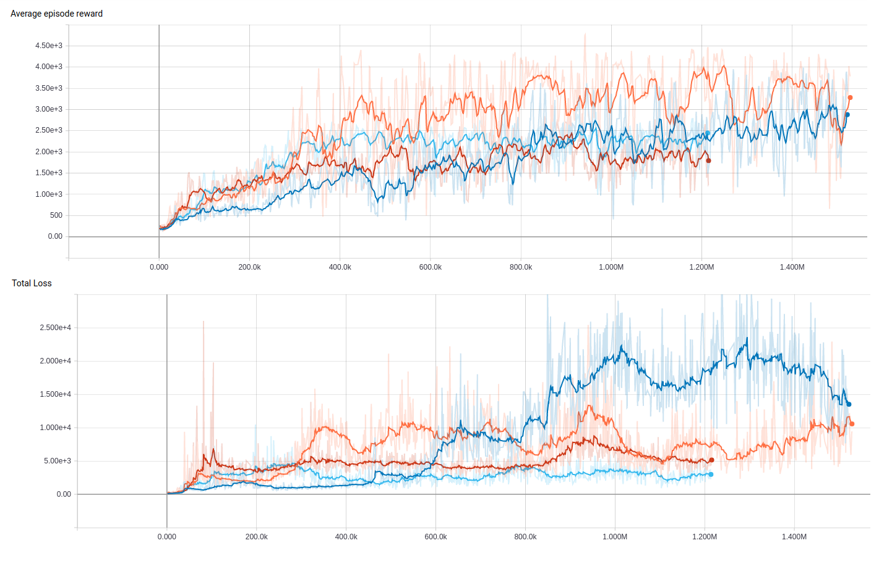
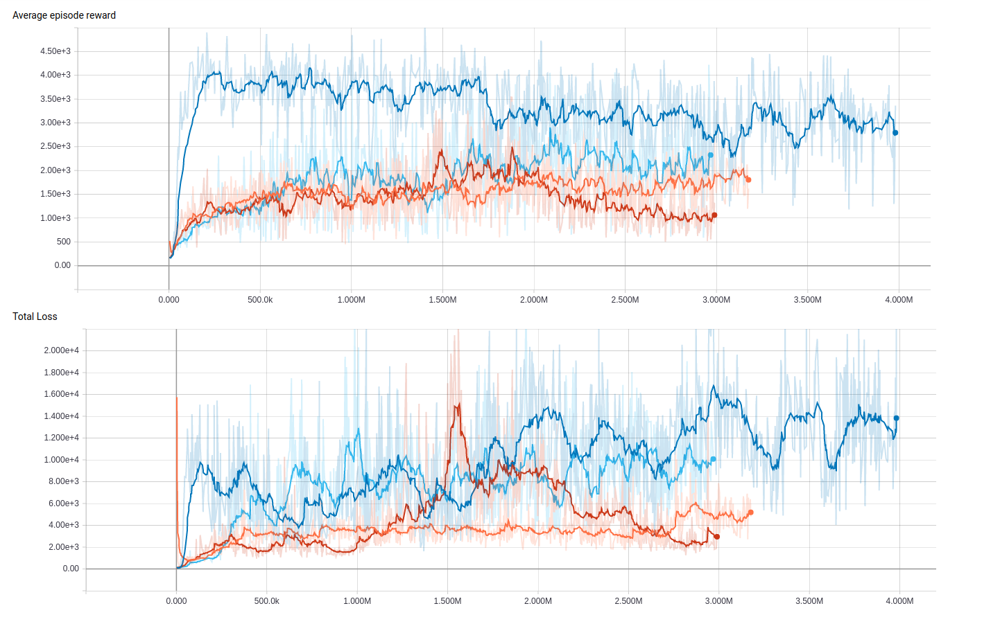

Neural Episodic Control Agent
=============================

This is an implementation of (a slightly modified version of) Deepmind's `Neural Episodic Control <https://arxiv.org/pdf/1703.01988.pdf>`_.

  The modifications:
    - The order of the LRU is modified only when the agent interacts its environment.
    - The convolutional layers are from the A3C's implementation of OpenAI.
    - The size of the input image is 42x42 pixels (Learning Atari: An Exploration of the A3C Reinforcement)

Dependencies
------------

- **Tensorflow**: https://github.com/tensorflow/tensorflow
- **numpy**: https://github.com/numpy/numpy
- **scipy**: https://github.com/scipy/scipy
- **LRU**: https://github.com/amitdev/lru-dict
- **FLANN**: https://github.com/Erotemic/flann
- **mmh3**: https://github.com/aappleby/smhasher (python wrapper: https://pypi.python.org/pypi/mmh3)
- **OpenAI gym**: https://github.com/openai/gym

Results of our experiments on ATARI 2600's Ms. PacMan
--------------------------
Our base experiments had the following parameters:
  * Input image size: 42x42
  * Size of the DNDs: 100k 

In the next experiments, we modified the size of the DNDs:
  * Input image size: 42x42
  * Size of the DNDs: 250k

In the last experiments, we modified the size of the input image size:
  * Input image size: 84x84
  * Size of the DNDs: 100k

Notes
-----
  - In case of FLANN, a fork is used instead of the original repo, because add_points() and remove_point() methods of FLANN has no python bindings in the original repo.
  - In the branch named "tab_update_for_neighbours" we modified the "_tabular_like_update" definition. In this case, the update doesn't      take place only when there is an exact state match, but when the L2 distances of some items in the DND and the actual state embedding are below a threshold value. It is welcomed to take experiments with this setup.
